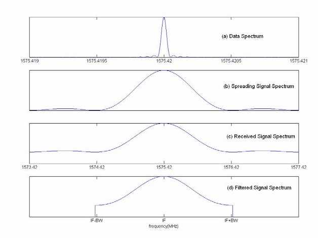

###2.1.3 频域上的L1CA信号

GPS信号可以很容易的在频域进行表示。GPS信号一产生，它便通过一条包含噪声和干扰的通道进行传播。在地面接收机的GPS信号是淹没在环境噪声中的，在捕获跟踪之前，对于时域信号，除了噪声什么也没有。对GPS信号在频域的分析是一个强大的鉴定信号特性的工具。因为本文讨论的是L1 C/A码信号模拟器的开发，因此P码和L2并不讨论。

GPS信号通过频谱扩展产生，它是将带宽为$$B_d$$的数据信号调制在连续的载波上形成$$d(t)$$，从而扩展频谱为$$B_s$$。频谱的扩展可以通过乘以一个更大带宽的码来完成。GPS信号的频谱扩展过程如图2.2所示。因为本图的目的是阐述GPS信号功率谱密度特性，因此y轴没有标明范围。

首先，值为$$\pm 1$$，速率为$$f_d$$（50Hz）的GPS导航电文比特流被调制在功率为$$P_d$$的载波上形成窄带信号，如图2.2(a)。该窄带信号宽带为$$B_d$$随即被码速率为$$f_c$$（1.023MHz）的C/A码扩展频谱。导航电文和C/A码有如下的功率频谱密度：

因为导航电文和发射时钟是同步的，因此扩展的频谱结果就是C/A码的频谱。最后，经过扩展的信号被搬移到以$$f_{L1}$$为中心频点的频率上，如图2.2(b)。GPS信号接下来通过一个有加性白噪声的传播通道，噪声的功率谱密度为$$N_0$$，来形成最后的接收信号，如图2.2(c)。接收到的信号在前端进行下变频以及滤波，经过滤波后的中频信号如图2.2(d)所示。

