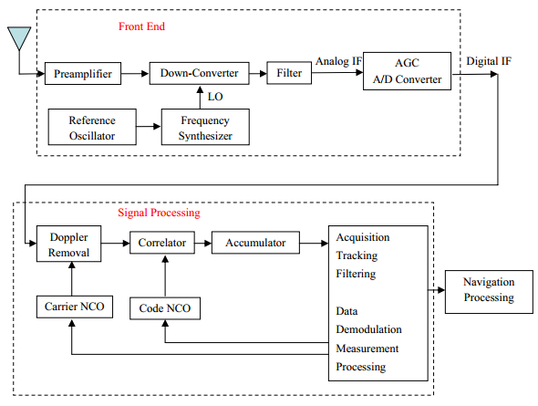

##2.2 传统的硬件前端与GPS接收机

有各种各样的为适应不同的应用环境的GPS接收机，因此很难定义一个典型的GPS硬件接收机。但是，依然可以基于接收机的设计要求，对一般GPS接收机进行描述。一台传统的GPS接收机的功能组成框架如图2.4所示。
一台GPS接收机可以分解成不同的组成部分。首先，天线以及一个前置放大器用来接收GPS射频信号。在天线接收信号之后，前端来完成下变频、采样并进行量化，从而将射频信号转换为中频信号。接下来就进入信号
处理部分，包括了捕获、跟踪和导航电文解算，从而得到伪距、载波相位和星历。最后的部分，完成用户位置和速度的解算。

